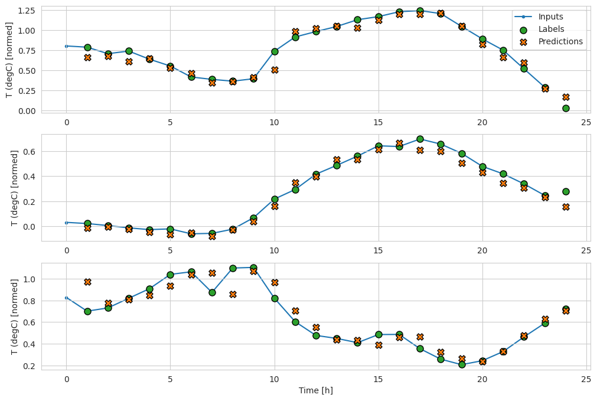
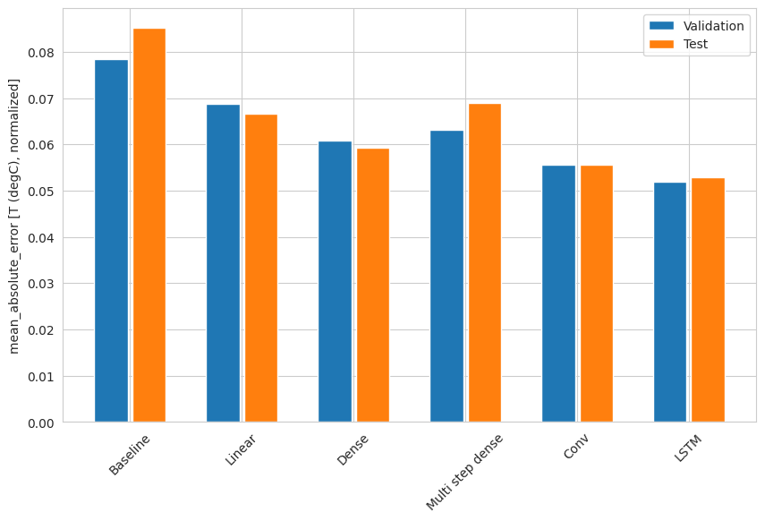
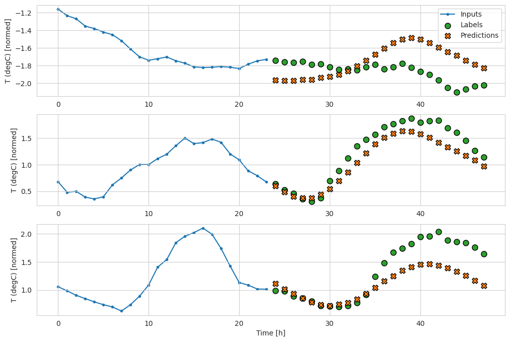
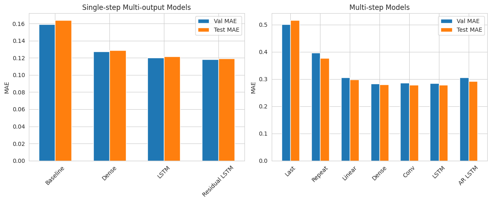

# Previsão de Séries Temporais com TensorFlow – Single-Step e Multi-Step

No contexto de previsão de séries temporais (Time Series Forecasting), podemos categorizar os modelos de acordo com (1) o **horizonte temporal** de previsão que eles produzem (quantos passos no futuro estamos prevendo) e (2) **quantas variáveis (features)** eles retornam como saída. Abaixo está uma visão geral:

1. ## **Single-step models**

Esses modelos fazem previsão de um único instante (ou único passo) à frente. Em outras palavras, eles estimam o valor (ou valores) em apenas um time step futuro. Se estivermos analisando uma série horária, por exemplo, o modelo faz a previsão para a hora t+1 dadas as condições até a hora t.

Exemplos:
- **Baseline**: Retorna o valor atual como previsão do próximo passo (ou outra forma de baseline, como devolver “sem variação”).
- **Linear**: Usa uma camada Dense(units=1) ou transformação linear para prever apenas o passo seguinte.
- **Dense** (MLP): Usa várias camadas densas para prever só o próximo valor.
- **CNN** (Conv1D em sequência curta): Observa uma janela de entradas (por exemplo, 3 horas de histórico) e retorna a previsão de apenas 1 hora à frente.
- **RNN**(LSTM ou GRU “single-step”): Processa várias horas de histórico, mas ao final retorna apenas 1 ponto de previsão para o próximo instante.




**Características**:

- A janela de entrada (por exemplo, 24 horas passadas) gera um único valor de saída (a hora seguinte).
- É útil quando precisamos de previsão pontual no curto prazo.

2. ## **Multi-output models**

Aqui, todos os passos que o modelo prevê ainda são para o mesmo instante de tempo, mas para diferentes variáveis (várias colunas/features). No tutorial, por exemplo, em vez de prever apenas T (degC), o modelo tenta prever todas as variáveis ao mesmo tempo, mas ainda para o mesmo instante futuro.

- **Exemplo**: Se temos as features temperatura,pressao,umidade,etc. no tempo t, o modelo retorna as previsões de temperatura,pressa~o,umidade,etc. no tempo *t+1*. Assim, em vez de `units=1` no último Dense, usamos `units=num_features` para prever **todas** as variáveis daquele próximo passo.

**Características**:
- Previsão ainda de **um** time step à frente, mas **todas as features** (ou um subconjunto maior de features) são previstas simultaneamente.
- Útil quando várias variáveis dependem umas das outras e queremos prever todas.

3. ## **Multi-step models**

Diferentemente dos anteriores, um **multi-step model** faz previsão para vários instantes à frente (vários passos futuros) — por exemplo, prever as próximas 24 horas, dadas as últimas 24 horas.

- **Single-shot**: O modelo produz **todas as previsões futuras de uma só vez**. Por exemplo, dados 24 horas de histórico, retorna um vetor com as 24 horas previstas.
  - *Exemplos*:
   - `multi_linear_model`: Pega só o último passo (hora t) e a partir dele gera 24 valores futuros.
   - `multi_dense_model`, `multi_conv_model` ou `multi_lstm_model` (single-shot): pegam uma janela de histórico e produzem 24 outputs em uma única saída.

- **Autoregressive (ou iterativo)**: O modelo faz previsões passo a passo, alimentando a previsão anterior como entrada do passo seguinte, até compor todo o horizonte (24 horas). Nesse caso, o modelo é treinado para prever **apenas 1 passo**, mas em produção roda em loop para “alimentar” a si mesmo.

**Características**:

- Observa-se uma janela de entrada (por exemplo, 24 horas) e se obtém **múltiplos passos** futuros (por exemplo, 24 horas à frente).
- Útil em cenários em que se deseja planejamento de médio/longo prazo (previsões em mais de um passo).


**Quando combinar “multi-output” e “multi-step”**

Um modelo *multi-step* naturalmente pode prever diversas variáveis em cada um desses passos no futuro (ou seja, 24 valores de temperatura, 24 valores de pressão, etc.). No tutorial do TensorFlow, isso aparece quando se fala em “Multi-step models that output all features”. É uma extensão na qual, a cada um dos N passos de previsão, retornamos todas as features.

| Tipo de modelo           | Horizonte                           | Número de variáveis previstas | Exemplo                                                        |
|--------------------------|-------------------------------------|-------------------------------|----------------------------------------------------------------|
| Single-step single-output| 1 passo à frente                    | 1 variável                    | Baseline, Linear, Dense, CNN, LSTM                             |
| Single-step multi-output | 1 passo à frente                    | todas as variáveis            | Modelo denso ou LSTM que retorna N features                    |
| Multi-step               | vários passos à frente (ex.: 24)    | 1 ou mais variáveis           | CNN/ LSTM que retorna 24 passos (cada um com 1 ou N variáveis) |
| Multi-step autoregressive| vários passos, iterativo            | 1 ou mais variáveis           | LSTM ou GRU rodando passo a passo e retroalimentando a si mesmo|



# Como Executar

1. **Clonar o repositório**:
```bash
   git clone https://github.com/seu-usuario/time-series-forecasting-tf.git
   cd time-series-forecasting-tf
   ```
2. **Criar e Ativar um Ambiente Conda**
Crie um ambiente para gerenciar as dependências do projeto e ative este ambiente:
```bash
   conda create --name tsf python=3.12
   conda activate tsf
   ```
3. **Instalar as Dependências**
Instale todas as dependências necessárias para o projeto utilizando o pip, conforme listado no arquivo `requirements.txt`:
```bash
   pip install -r requirements.txt
   ```
4. **Executar o Notebook**
Com o ambiente configurado e todas as dependências instaladas, você está pronto para executar o notebook do projeto:
```bash
   jupyter notebook
   ```
Navegue até o notebook desejado dentro da interface do Jupyter e execute as células para ver os resultados da previsão de série temporal.

# Referência

